# 🏥 Hospital Login & Appointment Management System

**8086 Assembly Language (DOS – INT 21H)**

---
## For better experience of UI, open this code on emu8086
## 📌 Overview

This project is a **console-based Hospital Management System** implemented entirely in **8086 Assembly Language** using **DOS interrupts (INT 21H)**.
It simulates a real-world hospital workflow including:

* Secure user authentication
* Role-based access control (Admin / Patient)
* Appointment booking and approval
* Waiting room queue management
* Notification system for patients

The system demonstrates **low-level system design**, **memory management**, and **data structure implementation** without relying on any high-level language features.

---

## 🎯 Key Objectives

* Apply **8086 microprocessor concepts** in a practical system
* Implement **authentication and authorization** at assembly level
* Simulate **queue operations** using arrays
* Enforce **business rules** (single admin, max users, max patients)
* Use **DOS services** for input/output handling

---

## ⚙️ System Features

### 🔐 Authentication System

* User registration with:

  * Username
  * Password
  * Role (Admin / Patient)
* **Only one Admin allowed**
* Login verification using string comparison
* Invalid credential handling

---

### 👨‍⚕️ Admin Dashboard

Admins can:

1. Register patients into the waiting room
2. Serve patients (FIFO)
3. Cancel all remaining appointments
4. Reverse the waiting line
5. View all registered patients
6. Logout securely

---

### 🧑‍💼 Patient Dashboard

Patients can:

1. Check waiting position
2. Request an appointment with preferred date/time
3. Receive admin approval/rejection notifications
4. Logout

---

### 🔔 Notification System

* Appointment **Accepted** → Confirmation message
* Appointment **Rejected** → Rejection alert
* Notifications reset after viewing

---

### 🧮 Data Structures Used

| Component     | Structure                    |
| ------------- | ---------------------------- |
| Users         | Fixed-size string arrays     |
| Roles         | Character array              |
| Notifications | Flag array                   |
| Appointments  | String buffer                |
| Waiting Room  | Queue (HEAD / TAIL pointers) |

---

## 📦 Capacity & Constraints

| Item                      | Limit             |
| ------------------------- | ----------------- |
| Maximum Users             | **5**             |
| Admin Accounts            | **1 only**        |
| Maximum Patients in Queue | **5**             |
| Username Length           | **20 characters** |
| Password Length           | **20 characters** |

These limits are **strictly enforced** at runtime.

---

## 🛠️ Technical Specifications

* **Architecture:** Intel 8086
* **Assembler:** MASM / TASM
* **Execution Mode:** Real Mode (DOS)
* **I/O Handling:** `INT 21H`
* **Memory Model:** SMALL
* **Stack Size:** `100H`

---

## 📂 Project Structure

```text
Hospital-Management-System/
│
├── hospital.asm      # Main assembly source file
├── README.md         # Project documentation
└── screenshots/      # (Optional) Output screenshots
```

---

## ▶️ How to Run

### Using DOSBox

1. Install **DOSBox**
2. Place `hospital.asm` inside a working directory
3. Mount the directory:

   ```
   mount c c:\path\to\project
   c:
   ```
4. Assemble:

   ```
   masm hospital.asm;
   link hospital.obj;
   ```
5. Run:

   ```
   hospital.exe
   ```

---

## 🧠 Key Concepts Demonstrated

* String handling using `$`-terminated buffers
* Manual memory offset calculation
* Role-based access logic
* Circular-style queue management
* Defensive programming in assembly
* Real-world system constraints at low level

---

## 🚀 Possible Enhancements

* Persistent storage (file I/O)
* Password masking
* Dynamic user capacity
* Multiple doctors
* Time-based appointment sorting
* Improved UI alignment

---

## 📜 Academic Relevance

This project is highly suitable for:

* **CSE370 – Database / Systems Lab**
* **CSE341 - Microprocessor & Assembly Language Courses**
* **Operating Systems Fundamentals**
* **Low-Level System Design Demonstrations**

---

## 👤 Author

**Amir Sakib Saad**
CSE Student | Systems & AI Enthusiast

---

## ⭐ Acknowledgment

This project is designed for educational purposes to demonstrate how real-world systems can be implemented at the **hardware-near software layer** using pure assembly language.


## 🖼️ Screenshots

### System Walkthrough

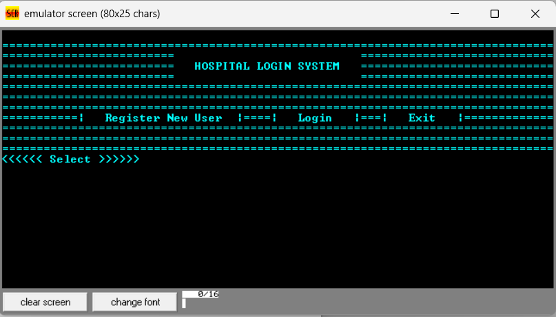
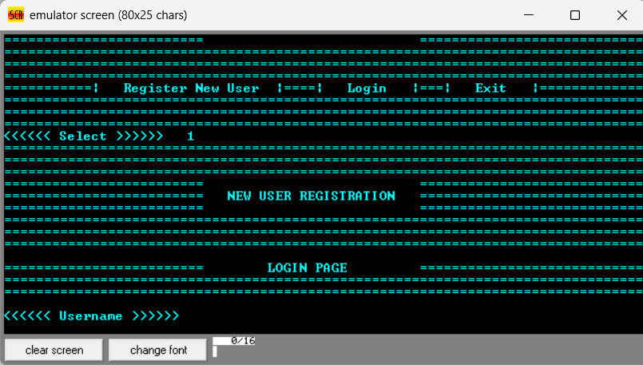
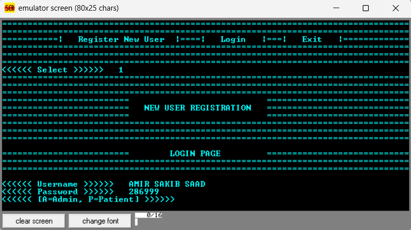

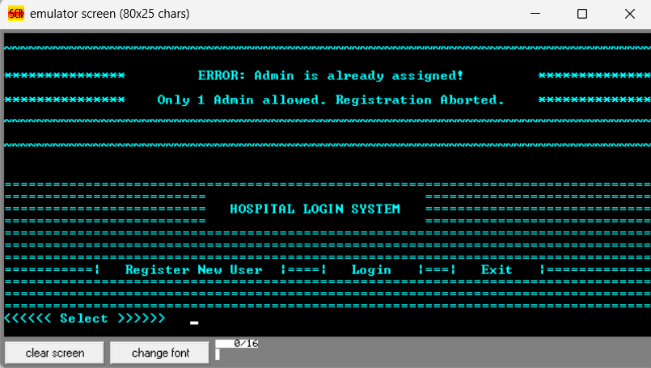
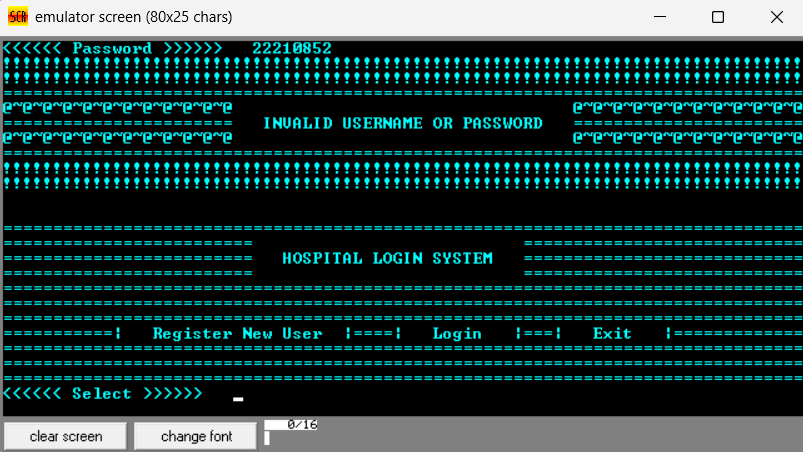
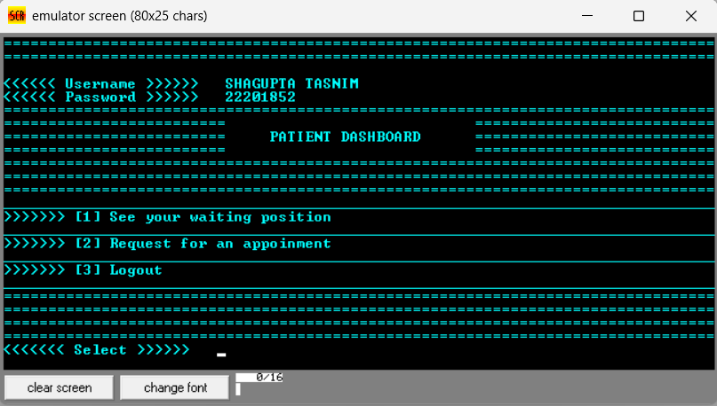
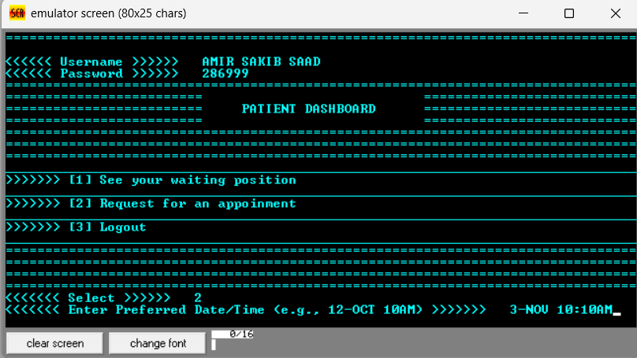
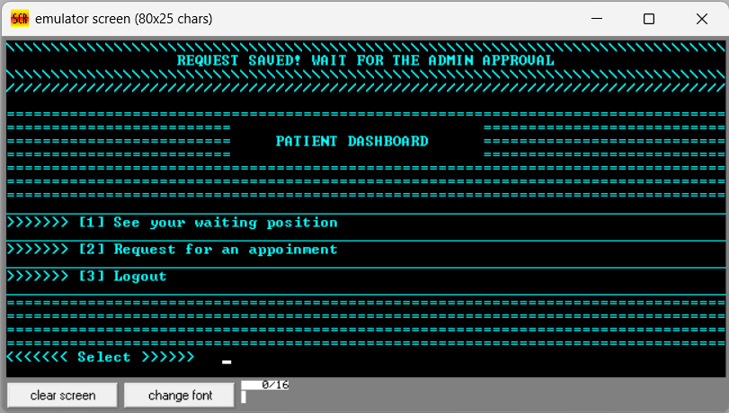
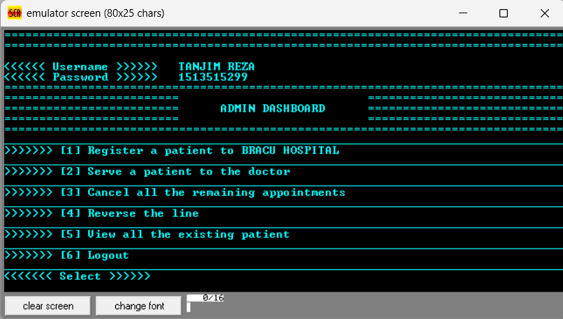
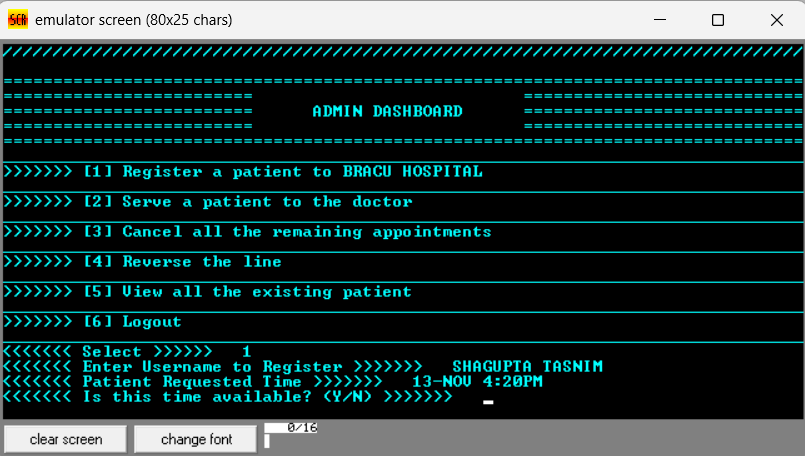
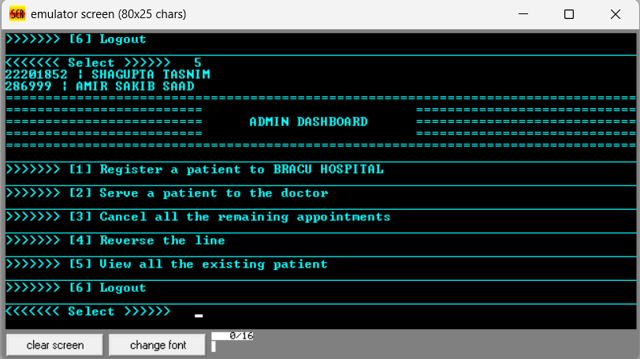
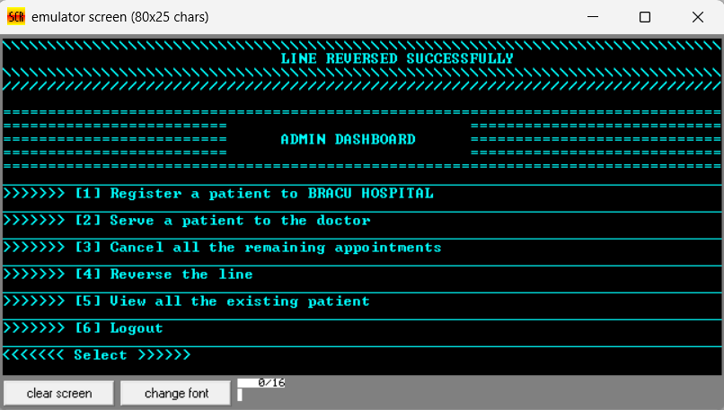
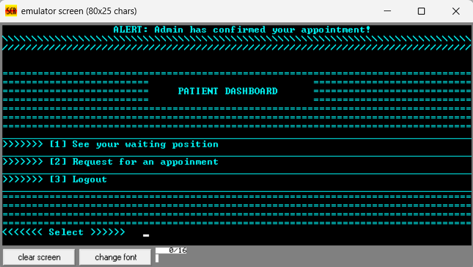
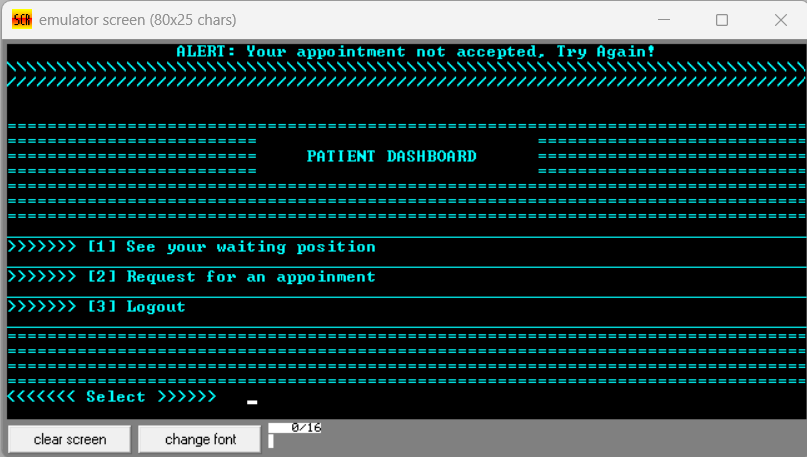
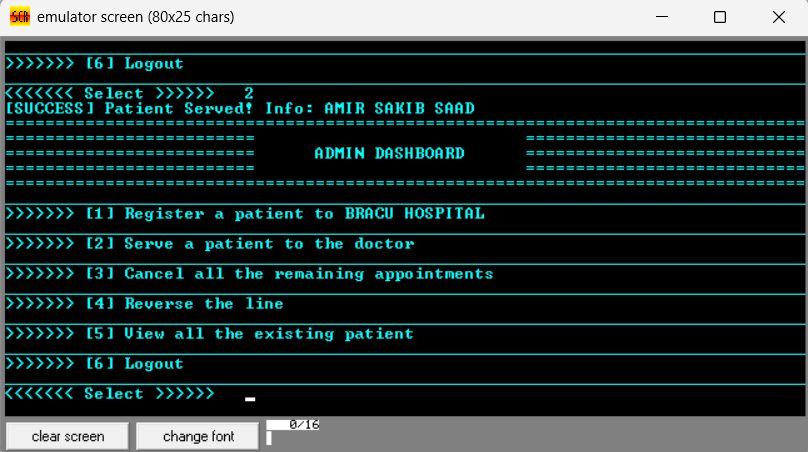
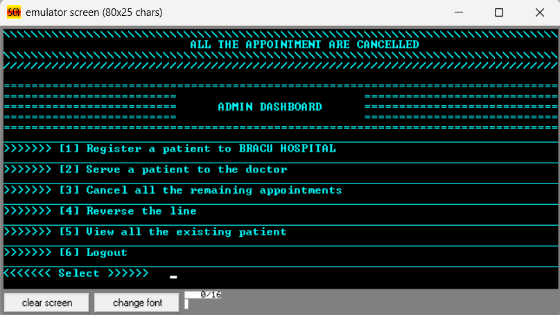
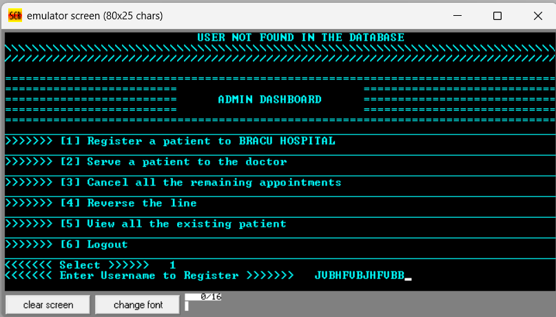

